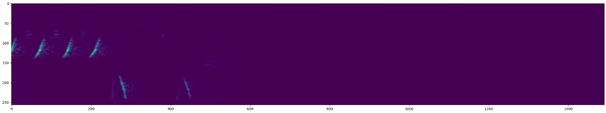
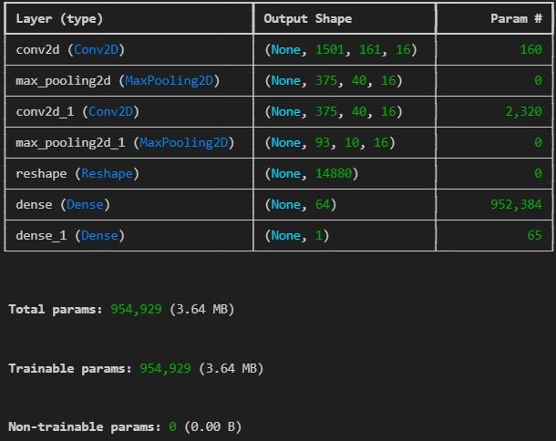
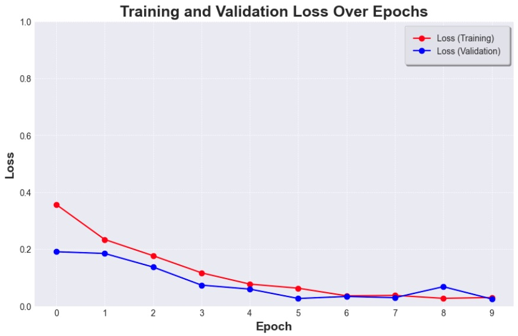
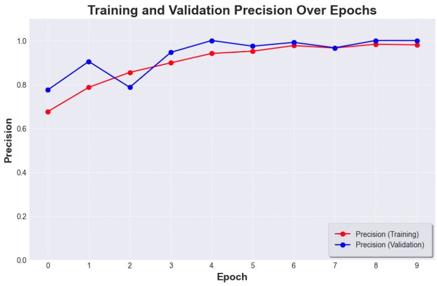
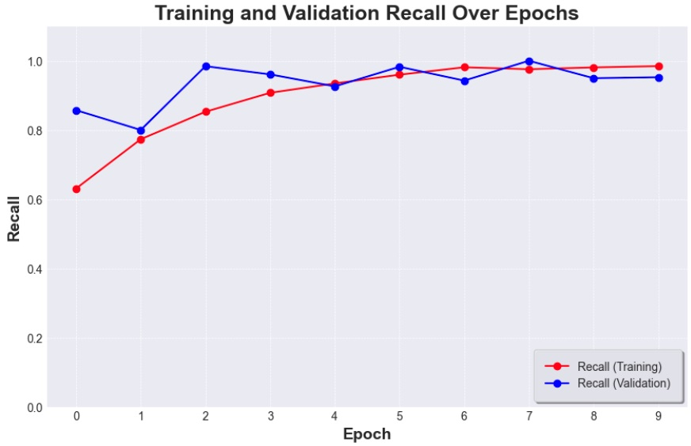
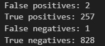

# sparrowdetect
Deep audio classifier model that detects sound of a Song Sparrow bird. It uses librosa and numpy to convert sound to spectogram and tensorflow for creating the model.

## Overview
Data collected for this project was downloaded from kaggle. It is recordings of 5 different bird calls, but this project focuses on recognizing Song Sparrow sounds.
- Spectogram:
    

- Model summary: 

    
- Loss

    
- Accuracy
    
    
- Recall
    
    
- Evaluation on a test batch
    
    

## Guide (Windows 11)

First, clone this repository: 

### 1. Clone this repository
    git clone https://github.com/makspiotrowski02/sparrowdetect.git
    cd sparrowdetect

### 2. Create and activate virtual environment
    python -m venv *env_name*
    *env_name*\Scripts\activate 

### 3. Install libraries
    pip install pandas matplotlib tensorflow tensorflow-io soundfile librosa numpy keras

### 4. Create data folder and subfolders
##### data
In data:
- sparrow
- other

### 5. Manually unzip archive and run the cells